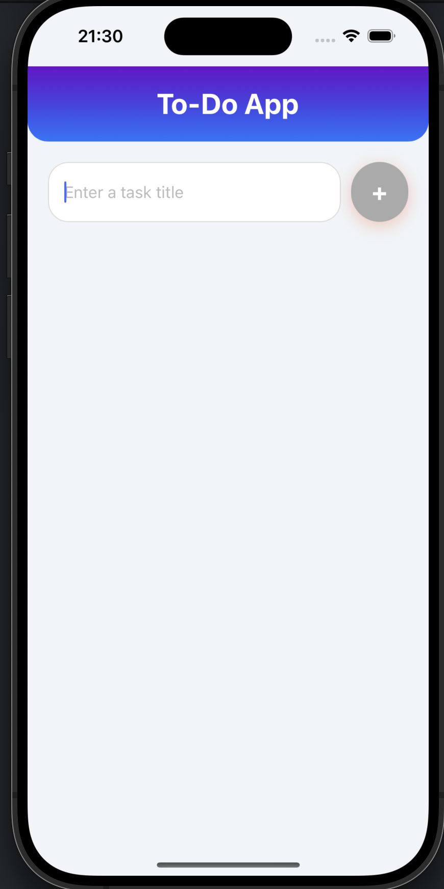
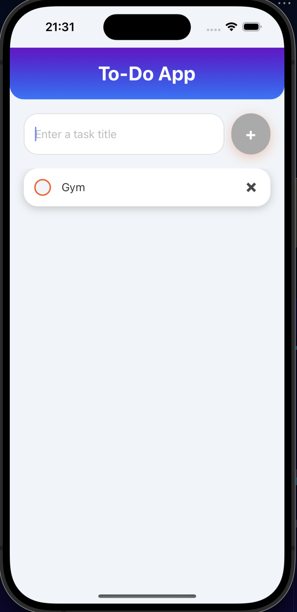
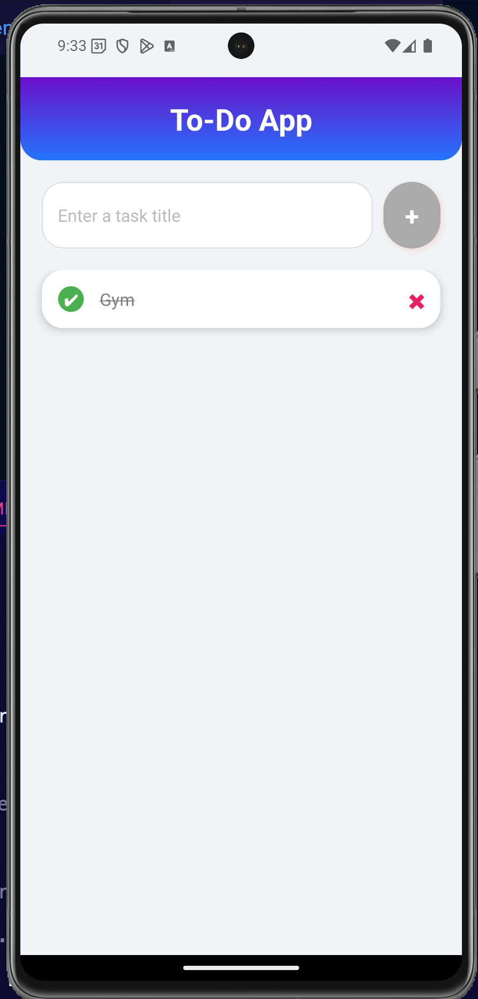

---

# To-Do App

A beautiful and interactive To-Do App built with React Native. It helps you organize tasks effectively with a clean, colorful UI. This app allows you to add, toggle, and delete tasks easily, with smooth animations to enhance user experience.

## ✨ Features

- 📋 **Task Management**: Add, complete, and delete tasks.
- 🌈 **Colorful & Modern UI**: Beautiful gradient headers, buttons, and animations.
- ✅ **Animated Feedback**: Smooth animations when adding tasks.

## 🛠️ Technologies Used

- **React Native**: A JavaScript framework for building native mobile apps.
- **Expo**: A platform for universal React applications.
- **Animated API**: React Native’s animation library for smooth transitions.
- **Linear Gradient**: Expo's gradient for modern and colorful UI.

## 📸 Screenshots

<div style="display: flex;">
  
  
  
</div>

## 🚀 Getting Started

Follow these steps to get the project up and running locally.

### Prerequisites

- **Node.js**: Recommended version [>= 16.0](https://nodejs.org/).
- **npm** or **Yarn**: Node package managers.
- **Expo CLI**: Run the following command to install:
  ```bash
  npm install -g expo-cli
  ```

### Installation

1. **Clone the repository**:

   ```bash
   git clone https://github.com/Qusai007/my-todo-app.git
   ```

2. **Navigate to the project directory**:

   ```bash
   cd todo-app
   ```

3. **Install dependencies**:

   Using npm:

   ```bash
   npm install
   ```

   Or using Yarn:

   ```bash
   yarn install
   ```

### Running the App

To run the app in the development environment:

1. **Start Expo**:

   ```bash
   npx expo start
   ```

2. **Run on Emulator or Device**:
   - You can use the **Expo Go app** to scan the QR code for running it on your physical device.
   - Alternatively, run on an Android/iOS simulator through the Expo Developer Tools.

## 📂 Project Structure

```
.
├── assets                  # Images and media files
├── App.js                  # Main application code
├── package.json            # Dependencies and project scripts
├── .expo                   # Expo configuration files
└── README.md               # Project documentation
```

## 🤝 Contributing

Contributions are welcome! Please follow these steps:

1. Fork the repository.
2. Create a new branch (`feature-name`).
3. Commit your changes (`git commit -m "Add some feature"`).
4. Push to the branch (`git push origin feature-name`).
5. Open a pull request.

## 📄 License

This project is licensed under the **MIT License**.

## 💬 Connect

- GitHub: [@Qusai007](https://github.com/Qusai007/)
- LinkedIn: [@qusai-johar](https://www.linkedin.com/in/qusai-johar/)

Feel free to share your feedback, ideas, or report bugs!

---

### 🚀 Quick Commands:

| Task                    | Command                      |
| ----------------------- | ---------------------------- |
| Clone Repository        | `git clone <repo-url>`       |
| Install Dependencies    | `npm install` or `yarn`      |
| Start Development Server| `expo start`                 |
| Lint the Code           | `npm run lint` (optional)    |

Enjoy building your to-do lists efficiently with a modern look! 🎉